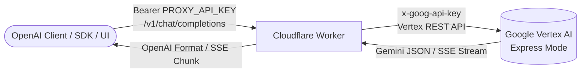

# Vertex OpenAI Bridge ⚡

An ultra-fast, lightweight Cloudflare Worker that acts as a 100% OpenAI-compatible API reverse proxy for **Google Vertex AI Express Mode** REST API.

Use all latest Gemini models (Gemini 2.5, Gemini 3, Flash, Flash-Lite, Nano Banana image generation) with any OpenAI-compatible client, SDK, or UI (e.g. Open WebUI, LibreChat, Cursor, Cline/Roo Code, NextChat) seamlessly.

---

## ✨ Features

- 🔄 **Full OpenAI API Compatibility**:
  - `POST /v1/chat/completions` (Standard & Streaming SSE)
  - `GET /v1/models` (Dynamic list of supported models)
  - `POST /v1/images/generations` (Text-to-Image & Image-to-Image via JSON)
  - `POST /v1/images/edits` (Image editing via `multipart/form-data`)
- 🧠 **Gemini 3 Thinking & Reasoning Support**:
  - Extracts and emits model thoughts in `message.reasoning` / `delta.reasoning` (matching OpenRouter / vLLM standard).
  - Full control over reasoning via `reasoning_effort` (`"low"`, `"medium"`, `"high"`, `"none"`) or `thinking: { include, budget_tokens }`.
- 🛠️ **Advanced Tool / Function Calling**:
  - **Thought Signature Smuggling (`__sig.`)**: Automatically preserves and passes Gemini 3 thought signatures across multi-turn tool calling without breaking OpenAI tool schemas.
  - **Tool Batching**: Automatically coalesces multiple sequential tool results into a single turn as required by the Vertex AI REST API.
- 🎨 **Image Generation & Editing ("Nano Banana")**:
  - Native support for image-capable models like `gemini-2.5-flash-image` and `gemini-3.1-flash-image`.
  - Automatic conversion between OpenAI `size` (e.g. `1024x1024`, `1792x1024`) and Gemini aspect ratios (`1:1`, `16:9`, `4:3`, `21:9`, etc.).
  - Handles `n > 1` image generation requests.
- 👁️ **Multimodal Vision**:
  - Accepts both `data:image/...;base64,...` data URIs and remote image URLs (automatically downloaded and converted to inline base64).
- 🛡️ **Built-in Resilience & CORS**:
  - Automatic exponential backoff retry on HTTP `429` (Quota / Rate limits) with 5s, 10s, 15s delays.
  - Full CORS support with zero-auth preflight `OPTIONS` handling and configurable allowed origin.

---

## 🏗️ Architecture



---

## 📋 Supported Models

| Model ID | Description | Modalities |
| :--- | :--- | :--- |
| `gemini-3.7-flash` | Latest Gemini 3.7 Flash with hybrid reasoning | Text, Vision, Reasoning, Tools |
| `gemini-3.6-flash` | Gemini 3.6 Flash | Text, Vision, Reasoning, Tools |
| `gemini-3.5-flash` | Gemini 3.5 Flash | Text, Vision, Reasoning, Tools |
| `gemini-3-flash-preview` | Gemini 3 Flash Preview | Text, Vision, Reasoning, Tools |
| `gemini-3.5-flash-lite` | Gemini 3.5 Flash Lite (ultra fast) | Text, Vision, Tools |
| `gemini-3.1-flash-lite` | Gemini 3.1 Flash Lite | Text, Vision, Tools |
| `gemini-2.5-flash` | Gemini 2.5 Flash flagship | Text, Vision, Reasoning, Tools |
| `gemini-2.5-flash-lite` | Gemini 2.5 Flash Lite | Text, Vision, Tools |
| `gemini-2.5-flash-image` | Gemini 2.5 Flash with native Image Output | Text, Vision, Image Generation |
| `gemini-3.1-flash-image` | Gemini 3.1 Flash with native Image Output | Text, Vision, Image Generation |
| `gemini-3.1-flash-lite-image` | Gemini 3.1 Flash Lite Image Generation | Text, Vision, Image Generation |

---

## 🚀 Quick Start

### 1. Prerequisites

- [Node.js](https://nodejs.org/) (v18+) & [npm](https://www.npmjs.com/)
- [Cloudflare Wrangler CLI](https://developers.cloudflare.com/workers/wrangler/install-and-update/)
- Google Vertex AI Express Mode API Key

### 2. Installation

Clone this repository and ensure Wrangler is ready:

```bash
git clone https://github.com/aegis-plus/vertex-openai.git
cd vertex-openai
```

### 3. Configure Secrets

Set your required environment secrets on Cloudflare:

```bash
# 1. Your Google Vertex AI Express Mode API Key
npx wrangler secret put VERTEX_EXPRESS_API_KEY

# 2. Your custom proxy API key (used by clients to authenticate with this worker)
npx wrangler secret put PROXY_API_KEY

# 3. (Optional) Custom CORS origin (defaults to "*" if omitted)
npx wrangler secret put CORS_ALLOW_ORIGIN
```

For local testing, create a `.dev.vars` file (never commit this):
```ini
VERTEX_EXPRESS_API_KEY="your-google-vertex-api-key"
PROXY_API_KEY="your-chosen-client-bearer-key"
CORS_ALLOW_ORIGIN="*"
```

### 4. Run Locally

```bash
npx wrangler dev
```

### 5. Deploy to Cloudflare

```bash
npx wrangler deploy
```

Your worker will be live at `https://<your-worker-name>.<your-subdomain>.workers.dev`.

---

## 💡 Usage Examples

### 1. cURL

#### Basic Chat Completion (Streaming)
```bash
curl https://vertex-openai.your-subdomain.workers.dev/v1/chat/completions \
  -H "Authorization: Bearer YOUR_PROXY_API_KEY" \
  -H "Content-Type: application/json" \
  -d '{
    "model": "gemini-2.5-flash",
    "messages": [
      {"role": "system", "content": "You are a helpful coding assistant."},
      {"role": "user", "content": "Explain async/await in JavaScript in 2 sentences."}
    ],
    "stream": true
  }'
```

#### Thinking / Reasoning with Gemini 3.7
```bash
curl https://vertex-openai.your-subdomain.workers.dev/v1/chat/completions \
  -H "Authorization: Bearer YOUR_PROXY_API_KEY" \
  -H "Content-Type: application/json" \
  -d '{
    "model": "gemini-3.7-flash",
    "reasoning_effort": "high",
    "messages": [
      {"role": "user", "content": "Solve the 8-queens problem with step-by-step logic."}
    ]
  }'
```

#### Image Generation
```bash
curl https://vertex-openai.your-subdomain.workers.dev/v1/images/generations \
  -H "Authorization: Bearer YOUR_PROXY_API_KEY" \
  -H "Content-Type: application/json" \
  -d '{
    "model": "gemini-2.5-flash-image",
    "prompt": "A futuristic cybernetic city at dusk with neon lights, 8k render",
    "size": "1792x1024"
  }'
```

---

### 2. Python (Official `openai` SDK)

```python
from openai import OpenAI

client = OpenAI(
    api_key="YOUR_PROXY_API_KEY",
    base_url="https://vertex-openai.your-subdomain.workers.dev/v1",
)

# Chat completion with streaming
response = client.chat.completions.create(
    model="gemini-3.7-flash",
    messages=[
        {"role": "system", "content": "You are an expert AI engineer."},
        {"role": "user", "content": "Write a quick explanation of Transformers."},
    ],
    stream=True,
)

for chunk in response:
    if chunk.choices[0].delta.content:
        print(chunk.choices[0].delta.content, end="", flush=True)
```

---

### 3. JavaScript / TypeScript (`openai` SDK)

```typescript
import OpenAI from "openai";

const openai = new OpenAI({
  apiKey: "YOUR_PROXY_API_KEY",
  baseURL: "https://vertex-openai.your-subdomain.workers.dev/v1",
});

async function main() {
  const completion = await openai.chat.completions.create({
    model: "gemini-2.5-flash",
    messages: [{ role: "user", content: "Hello Gemini via OpenAI API!" }],
  });

  console.log(completion.choices[0].message.content);
}

main();
```

---

### 4. UI Client Integrations

| Client | Base URL / API Host | API Key |
| :--- | :--- | :--- |
| **Open WebUI** | `https://vertex-openai.<subdomain>.workers.dev/v1` | `YOUR_PROXY_API_KEY` |
| **LibreChat** | `https://vertex-openai.<subdomain>.workers.dev/v1` | `YOUR_PROXY_API_KEY` |
| **Cursor / Cline / Roo Code** | `https://vertex-openai.<subdomain>.workers.dev/v1` | `YOUR_PROXY_API_KEY` |
| **Cherry Studio / NextChat** | `https://vertex-openai.<subdomain>.workers.dev` | `YOUR_PROXY_API_KEY` |

---

## ⚙️ Environment Variables

| Variable | Type | Required | Description |
| :--- | :--- | :--- | :--- |
| `VERTEX_EXPRESS_API_KEY` | Secret | **Yes** | Google Cloud Vertex AI Express Mode API key. |
| `PROXY_API_KEY` | Secret | **Yes** | Client Bearer authentication token. |
| `CORS_ALLOW_ORIGIN` | Secret / Var | No | CORS allowed origin (defaults to `*`). |

---

## 📄 License

MIT License. Feel free to use, modify, and distribute.
